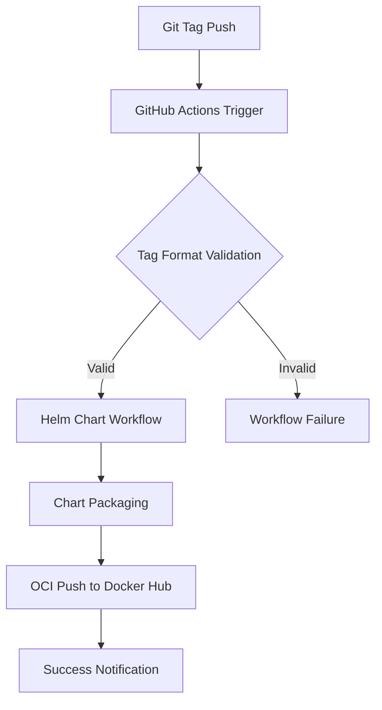

# Design Document

## Overview

This design implements an automated GitHub Actions workflow that packages and deploys Helm charts to Docker Hub using OCI (Open Container Initiative) compatibility. The solution extends the existing CI/CD pipeline to handle Helm chart distribution alongside Docker image releases, triggered exclusively by git tag pushes to ensure controlled releases.

The design leverages Docker Hub's OCI artifact support to store Helm charts as OCI artifacts, enabling users to pull charts using standard `helm pull oci://` commands. This approach provides a unified distribution mechanism where both application Docker images and Helm charts are stored in the same registry namespace.

## Architecture

### Workflow Trigger Architecture


### Integration with Existing CI/CD
The new Helm chart workflow will be implemented as a separate GitHub Actions workflow file that runs in parallel with the existing `release.yml` workflow. Both workflows will be triggered by the same git tag push event but will operate independently:

- **release.yml**: Handles application building, testing, and Docker image publishing
- **helm-chart.yml**: Handles Helm chart packaging and OCI publishing

### Registry Structure
The Helm charts will be stored in Docker Hub using the following structure:
- **Repository**: `savantly/nexus-command-helm`
- **OCI Reference Format**: `oci://registry-1.docker.io/savantly/nexus-command-helm`
- **Versioning**: Charts will be tagged with the same version as the git tag

## Components and Interfaces

### GitHub Actions Workflow Components

#### 1. Trigger Configuration
```yaml
on:
  push:
    tags:
      - '*'
```
The workflow will trigger on any tag push, providing flexibility for different versioning schemes while maintaining release control.

#### 2. Helm Setup Action
- **Purpose**: Install and configure Helm CLI with OCI support
- **Implementation**: Use `azure/setup-helm@v3` action
- **Version**: Latest stable Helm version (3.8.0+) with native OCI support

#### 3. Docker Hub Authentication
- **Reuse Existing Secrets**: Leverage `DOCKERHUB_USERNAME` and `DOCKERHUB_TOKEN` secrets already configured for the release workflow
- **Authentication Method**: Use `helm registry login` command with Docker Hub registry endpoint

#### 4. Chart Packaging Component
- **Input**: Helm chart source files in `helm/nexus-command/`
- **Process**: Execute `helm package` command to create `.tgz` archive
- **Output**: Packaged chart file with version from Chart.yaml
- **Validation**: Verify chart structure and dependencies before packaging

#### 5. OCI Push Component
- **Registry Target**: `oci://registry-1.docker.io/savantly/nexus-command-helm`
- **Push Command**: `helm push <chart-package>.tgz oci://registry-1.docker.io/savantly/nexus-command-helm`
- **Version Handling**: Chart version from Chart.yaml will be used as the OCI tag

### External Interfaces

#### Docker Hub OCI Registry Interface
- **Endpoint**: `registry-1.docker.io`
- **Authentication**: Docker Hub credentials via existing repository secrets
- **Protocol**: OCI-compliant artifact storage
- **Namespace**: `savantly/nexus-command-helm`

#### Helm Client Interface
- **Pull Command**: `helm pull oci://registry-1.docker.io/savantly/nexus-command-helm --version <version>`
- **Install Command**: `helm install <release-name> oci://registry-1.docker.io/savantly/nexus-command-helm --version <version>`
- **Compatibility**: Helm 3.8.0+ with native OCI support

## Data Models

### Workflow Configuration Model
```yaml
name: Helm Chart OCI Deployment
on:
  push:
    tags: ['*']
env:
  CHART_PATH: helm/nexus-command
  OCI_REGISTRY: oci://registry-1.docker.io/savantly/nexus-command-helm
jobs:
  helm-oci-deploy:
    runs-on: ubuntu-latest
    steps:
      - checkout
      - setup-helm
      - authenticate-registry
      - package-chart
      - push-chart
```

### Chart Metadata Model
The existing Chart.yaml structure will be preserved:
```yaml
apiVersion: v2
name: nexus-command
description: A Helm chart for Nexus Command - Multi-tenant business data management platform
type: application
version: 3.4.2  # This version will be used for OCI tagging
appVersion: "latest"
dependencies:
  - name: postgresql
    version: "~16.7.27"
    repository: "https://charts.bitnami.com/bitnami"
    condition: postgresql.enabled
```

### OCI Artifact Model
```
Registry: registry-1.docker.io
Repository: savantly/nexus-command-helm
Tag: <chart-version>
Media Type: application/vnd.cncf.helm.chart.content.v1.tar+gzip
Digest: sha256:<hash>
```

## Error Handling

### Authentication Failures
- **Detection**: Monitor `helm registry login` exit codes
- **Response**: Fail workflow with clear error message without exposing credentials
- **Logging**: Log authentication attempt without sensitive information

### Chart Packaging Failures
- **Validation Errors**: Check Chart.yaml syntax and required fields
- **Dependency Issues**: Validate chart dependencies and repository accessibility
- **File Structure**: Ensure all required chart files are present
- **Response**: Provide detailed error messages with specific failure reasons

### OCI Push Failures
- **Network Issues**: Implement retry logic for transient network failures
- **Registry Errors**: Handle Docker Hub API errors and rate limits
- **Version Conflicts**: Detect and report version conflicts if chart already exists
- **Disk Space**: Monitor available disk space during packaging operations

### Workflow State Management
- **Partial Failures**: Ensure workflow fails completely if any step fails
- **Cleanup**: Remove temporary files and logout from registry on failure
- **Status Reporting**: Set appropriate GitHub Actions status for each step

## Testing Strategy

### Unit Testing Approach
Since this is a GitHub Actions workflow, testing will focus on:

#### 1. Workflow Syntax Validation
- **Tool**: GitHub Actions workflow validator
- **Scope**: YAML syntax, action references, and step dependencies
- **Automation**: Include in pre-commit hooks or CI validation

#### 2. Chart Validation Testing
- **Tool**: `helm lint` command integration
- **Scope**: Chart structure, template syntax, and value validation
- **Integration**: Add chart linting step to the workflow

#### 3. Local Testing Environment
- **Setup**: Use `act` tool to run GitHub Actions locally
- **Mock Registry**: Use local OCI registry for testing push operations
- **Test Data**: Create test charts with various configurations

### Integration Testing Strategy

#### 1. End-to-End Workflow Testing
- **Environment**: Use GitHub Actions test repository
- **Process**: Create test tags and verify complete workflow execution
- **Validation**: Confirm charts are successfully pushed and pullable

#### 2. Registry Integration Testing
- **Docker Hub Testing**: Verify authentication and push operations
- **Chart Retrieval**: Test `helm pull` operations from published charts
- **Version Management**: Validate version tagging and retrieval

#### 3. Compatibility Testing
- **Helm Versions**: Test with different Helm client versions (3.8.0+)
- **OCI Registries**: Validate compatibility with Docker Hub OCI implementation
- **Chart Dependencies**: Test charts with various dependency configurations

### Monitoring and Observability

#### 1. Workflow Metrics
- **Success Rate**: Track successful vs failed deployments
- **Execution Time**: Monitor workflow duration and identify bottlenecks
- **Error Patterns**: Analyze common failure modes

#### 2. Registry Metrics
- **Push Success Rate**: Monitor OCI push operation success
- **Chart Download Metrics**: Track chart pull operations (if available)
- **Storage Usage**: Monitor registry storage consumption

#### 3. Alerting Strategy
- **Failure Notifications**: Configure GitHub Actions notifications for failures
- **Dependency Alerts**: Monitor for chart dependency updates
- **Security Alerts**: Track security vulnerabilities in chart dependencies