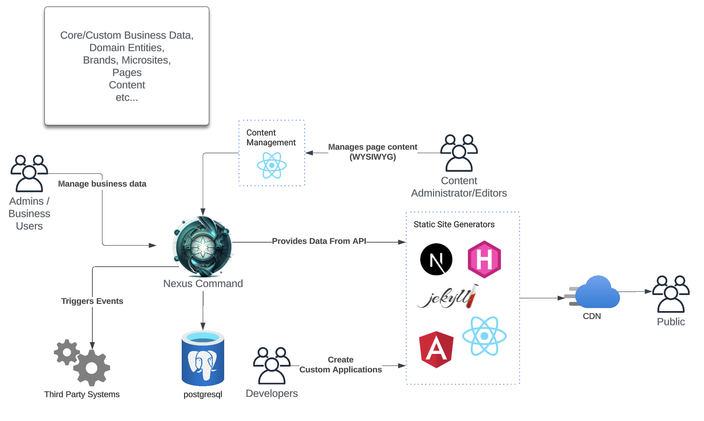
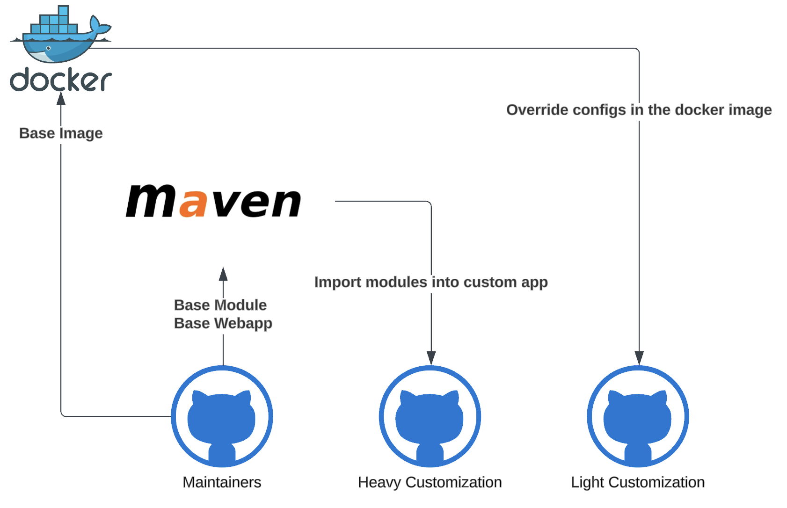
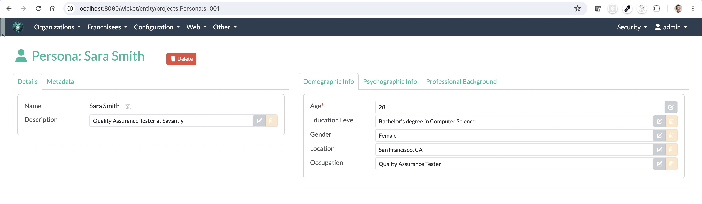
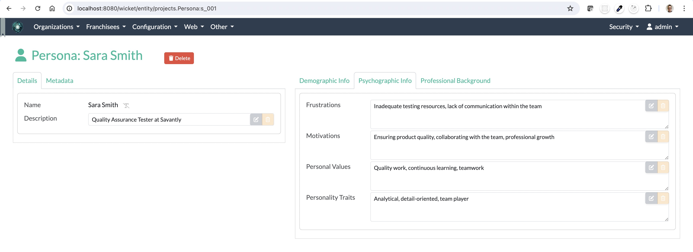
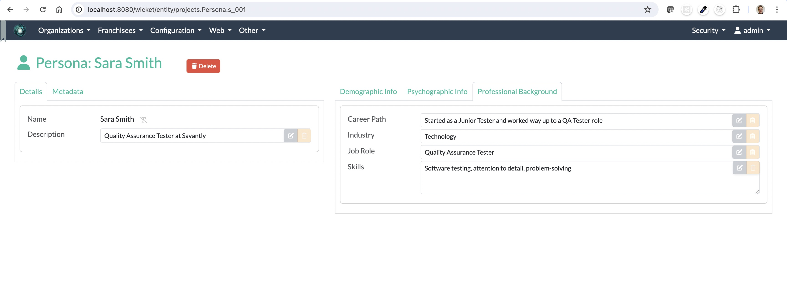
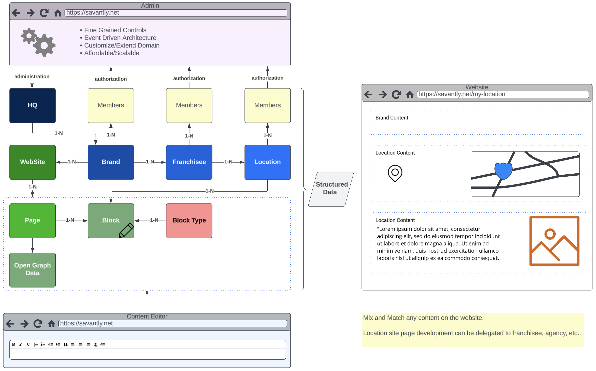
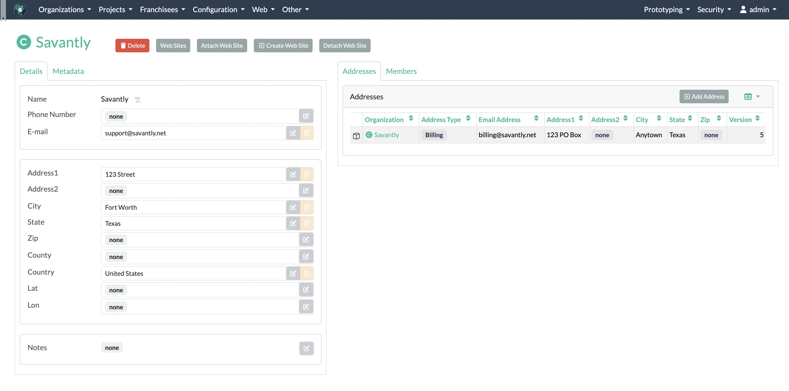
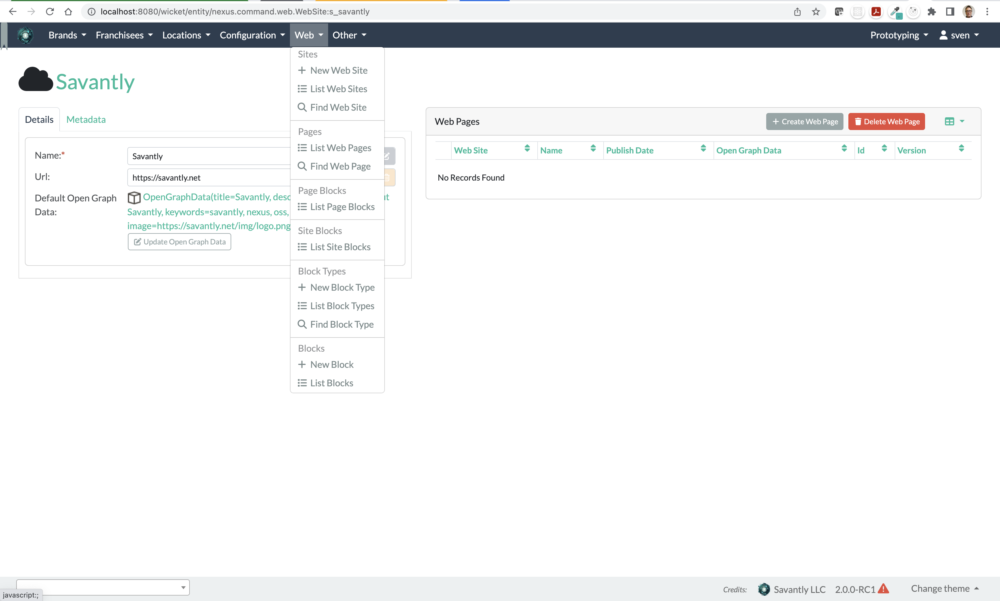

= Nexus Command
:toc:
:toc-placement!:

toc::[]

== TLDR;
```shell
docker run -p 8080:8080 savantly/nexus-command
```

=== Common Configurations
You can set these as properties or environment variables.

```yaml
nexus.modules.organizations.enabled: true # enable the organizations module
nexus.modules.projects.enabled: true # enable the projects module
nexus.modules.franchise.enabled: true # enable the franchise module
nexus.modules.web.enabled: true # enable the web module
nexus.modules.org-web.enabled: true # enable the org-web module
nexus.modules.security.enabled: true # enable the security module
```

See the application properties for more configuration options.  

link:./src/main/resources/application.yml[]

== Overview

Nexus Command is a multi-tenant application that provides a platform for managing all types of business data.  
It's built on top of the link:https://causeway.apache.org[Apache Causeway] framework, and provides a starting point for managing your own data and creating custom applications/integrations.

One typical use-case is to provide a platform for managing business data, providing the data as content, and integrating with third party systems.





=== Levels of customization:  

You can use the default webapp which includes all the modules, or you can create your own webapp and include any modules you need.  
The modules are maintained in this repo, and published to Maven Central.  




== Introduction

This is an link:https://causeway.apache.org[Apache Causeway] application, using best practices and conventions.  
It takes advantage of the rapid development capabilities of Causeway, and provides enterprise-grade features.  

It consists of several modules that provide a starting point for building your own application.  

You can use the webapp directly, or you can use the modules in your own Webapp project and customize it to your needs.  
The default webapp is configurable to include or exclude modules as needed.  


[TIP]
====
TODO: add a link to the demo site here
====


== Quick start

* install prereqs:

** Java 17 LTS (eg link:https://adoptopenjdk.net/[Adopt OpenJDK] distribution)
** Maven 3.6 or later (http://maven.apache.org/download.cgi[download])
* Clone the repository:
+
[source,bash]
----
git clone git@github.com:savantly-net/nexus-command.git
# or
git clone https://github.com/savantly-net/nexus-command.git

cd nexus-command
----

* Build using Maven:
+
[source,bash]
----
mvn clean install
----

* Run using Maven:
+
[source,bash]
----
mvn -pl webapp spring-boot:run
----

=== Build the docker image
[source,bash]
----
make build
----

=== Run the docker image
[source,bash]
----
make run-image
----


=== Load-time weaving
* Download the `spring-instrument.jar` for load-time weaving (discussed in more detail xref:#orm-support[below]):
+
[source,bash]
----
mvn dependency:get -DgroupId=org.springframework -DartifactId=spring-instrument -Dversion=XXX
----
+
Change "XXX" to the value that `${spring-framework.version}` resolves to in the webapp `pom.xml`

* Run using Maven:
+
[source,bash]
----
mvn -pl webapp spring-boot:run
----

=== Access the application
The application will be available at http://localhost:8080.  

* Browse to http://localhost:8080.

* Login using:

** either the secman superuser:

*** username: `secman-admin`
*** password: `pass`

** as a Nexus Command admin:

*** username: `admin`
*** password: `admin`

** or as an unprivileged user:

*** username: `user`
*** password: `user`

+
The app runs with H2 running in-memory, with sample data set up using fixture scripts.


== Application Structure

The following table explains the contents of each of the directories:


[#orm-support]
== ORM Support

This version of the application uses EclipseLink JPA as its ORM, configured with load-time weaving.
This requires that the application be run with a Java agent.

The spring-boot plugin is configured to run with this agent already.
If you want to run from an IDE:

* first, you might wish to copy the file locally:
+
[source,bash]
----
cp ~/.m2/repository/org/springframework/spring-instrument/XXX/spring-instrument-XXX.jar lib/spring-instrument.jar
----
+
Change "XXX" to the value that `${spring-framework.version}` resolves to in the webapp `pom.xml`

* Then specify the agent as a VM option:
+
[source,bash]
----
-javaagent:lib/spring-instrument.jar
----

== Testing

The application has both unit tests and integration tests.

.Testing types
[cols="5a,12a,6a,3a", options="header"]
|===

| Test type
| Report
| Phase
| Skip using

| Unit test
| `target/surefire-unittest-reports`
| `test`
| `-DskipUTs`

| Integ test
| `target/surefire-integtest-reports`
| `integration-test`
| `-DskipITs`


|===


These outputs can for example be processed within/published by a continuous pipeline.


== Translations

Apache Causeway supports i18n using link:https://www.gnu.org/software/gettext/manual/html_node/PO-Files.html[GNU .po file]s.
The `WEB-INF/translations.po` is the fallback (an empty value means that the key is used "as-is"), while `WEB-INF/translations-XX.po` files provide translations for each "XX" locale.

Translations are required for all domain classes and all members (actions, properties and collections) of all classes.
This information is available from the metamodel, and so a new template `translations.po` is generated as a side effect of running the integration tests (through a log4j2 logger).
A good integration test to run is `ValidateDomainModel_IntegTest`.

In addition, translations are required for any validation messages triggered by the test.
Running an integration tests that trigger validations will result in these messages being captured as keys, for example `Smoke_IntegTest`.

The generated file should be merged with any existing translations in `WEB-INF/translations.po`, and translations obtained for any new keys (there are numerous online services that support the format).


== Flyway

The application also demonstrates how to use Flyway to migrate the database schema.

By default the app runs using an in-memory database.
The Flyway example is activated using the "SQLSERVER" Spring Boot profile, eg:

[source,bash]
----
mvn -Dspring.profiles.active=SQLSERVER -pl webapp install
mvn -Dspring.profiles.active=SQLSERVER -pl webapp spring-boot:run
----

This causes the properties defined in  `config/application-SQLSERVER.properties` file to be used in preference to those in the default `config/application.properties` file.
It defines the following:

* `spring.flyway.url`, `spring.flyway.user` and `spring.flyway.password`
+
The presence of these is enough to enable the Flyway integration

* `spring.flyway.enabled`
+
This is explicitly set to `true`, to override the value in the default `config/application.properties`.


The Spring Boot profile is also used to add the dependency to the POSTGRES Server driver is included (it is hidden behind a Maven profile).

The prerequisites to try this out are a POSTGRES Server database running on `localhost` and with the credentials as specified in `config/application-POSTGRESQL.properties`; adjust as necessary.


== Use Cases

Nexus Command has countless use-cases.  
Although, a generalized use-case is to provide a platform for managing your core business data, and integrate with third party systems.  
By using Nexus as the "source of truth" for your business data, you can easily create custom applications and integrations that are specific to your business needs, without being tied to a specific vendor or platform.  

The following features are (or will be) included in the default webapp:  

* Website management (beta)
* Organization management (beta)
* Franchisee management (beta)
* Content management (beta)
* SEO (beta)
* Employee management (alpha)
* Product management (planned)
* Inventory management (planned)
* Customer management (planned)
* Sales management (planned)
* Reporting (planned)
* Analytics (planned)
* Marketing (planned)
* Advertising Integration (planned)
* Social media Integration (planned)
* E-commerce (considering)


=== Project Management
Manage projects and tasks, and track progress.  
Generate personas with AI to help generate better user stories and acceptance criteria.  

Persona Generation  


Persona Psychographics  


Persona Professional Background


=== Franchise Management
As a franchise operator or owner, fine-grained control of content and data can facilitate a consistent brand experience across all locations.  
Nexus Command faciliates granular content management delegation to a franchisee or agency, while maintaining control of the brand.  




=== Organization Management

Organization Manager  




=== Website Management  
This is a prrof of concept that allows delegating content management to a franchisee or agency.  

  
